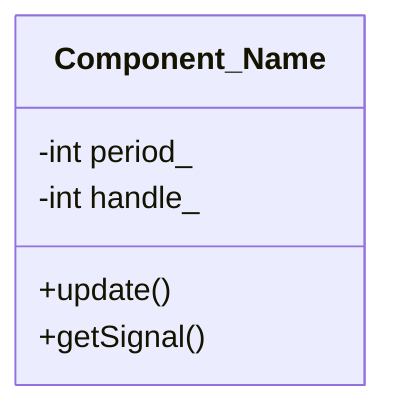

<p align="center">
  <h1 align="center">Component_Name</h1>
  <p align="center">
    A professional collection description for building robust algorithmic trading systems.
  </p>
</p>

---

## Overview

Provide a comprehensive overview of the component, component logic, or system specifications here.

## Purpose

Define the design rationale and target financial instrument environment (e.g., XAU/USD).

## Features

- [ ] Core Feature 1
- [ ] Core Feature 2

## Inputs

| Parameter Name  | Default Value | Description                                       |
| :-------------- | :------------ | :------------------------------------------------ |
| `InpFastPeriod` | `9`           | Fast Exponential Moving Average period allocation |
| `InpSlowPeriod` | `21`          | Slow Exponential Moving Average period allocation |

## Outputs

Describe runtime UI plots, historical logging, global terminal flags, or chart output states.

## Architecture

```
MQL5 Standard Library
         |
         v
 Reusable Classes (include/)
         |
         v
Expert Advisors • Indicators • Scripts
```

## Algorithm

Step-by-step description of state mutations, execution triggers, and underlying operational flow.

## Class Diagram



## Usage

```cpp
// Usage documentation block
```

## Screenshots

Provide context links to operational charts or test visuals located in assets/.

## Future Improvements

- [ ] Optimization passes on structural memory layouts.

## Changelog

### [1.0.0] - 2026-07-01

- Initial system prototype design alignment.
