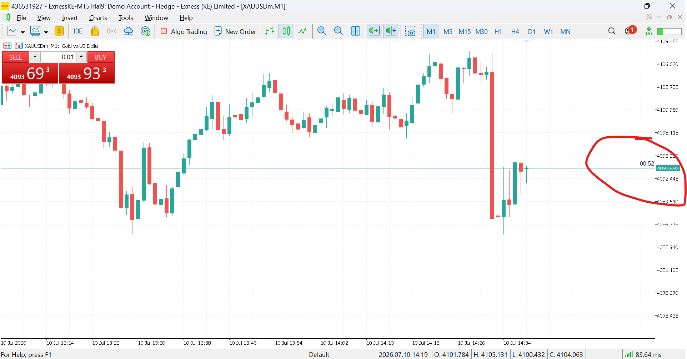
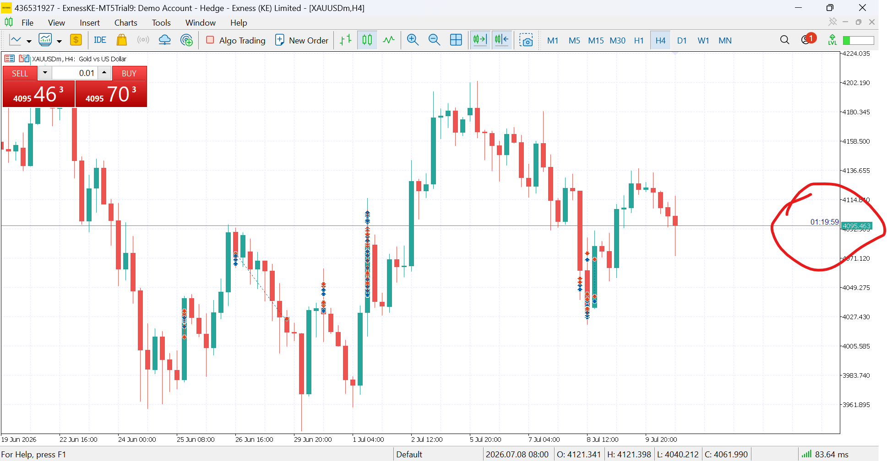
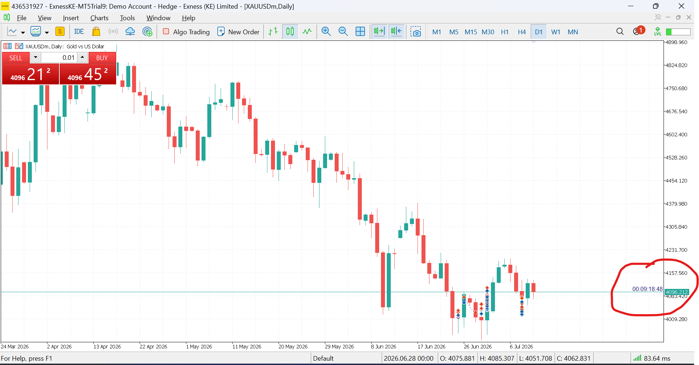
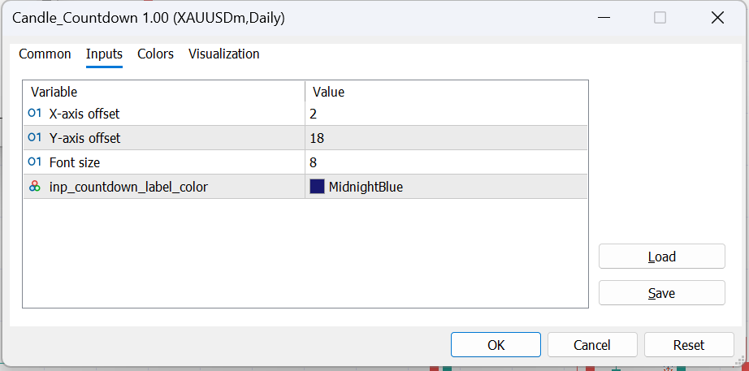
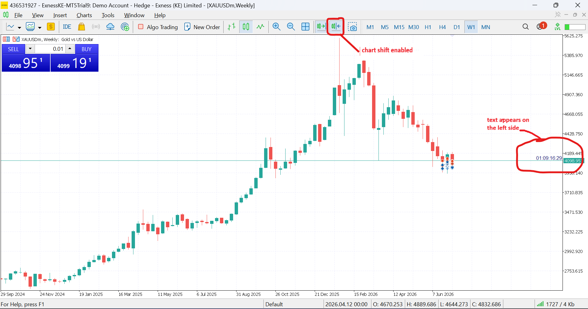
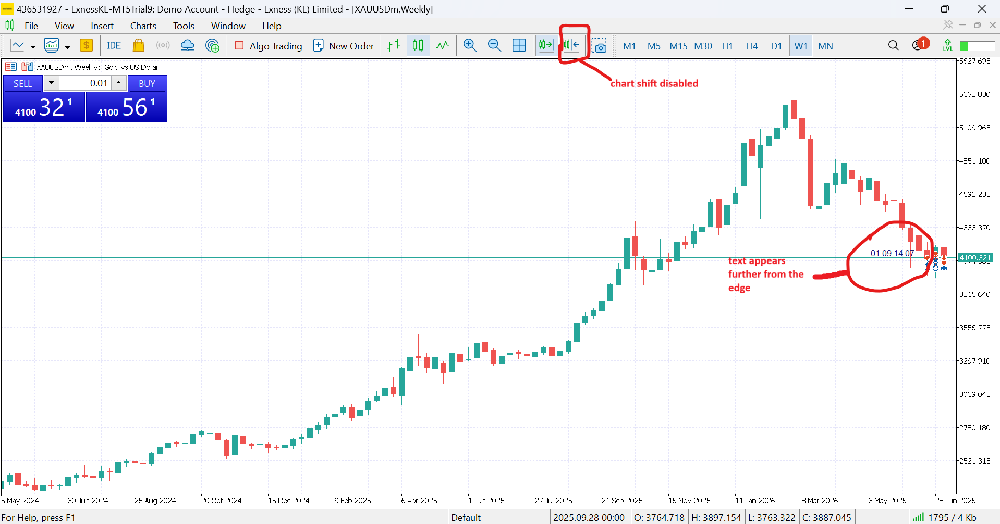

# ⏳ Candle Countdown Indicator

## Purpose

Displays a live, pixel-perfect countdown timer that tracks exactly how much time remains until the current candle closes. The label is pinned to the right edge of the chart window and follows the bid price vertically, ensuring it is always visible regardless of horizontal scroll, zoom level, or chart shift state.

---

## Features

- **Live second-by-second countdown** synchronized to broker server time
- **Adaptive time formatting** — automatically switches display based on timeframe:
  - `MM:SS` for M1–M30
  - `HH:MM:SS` for H1–H4
  - `DD:HH:MM:SS` for Daily / Weekly
  - `WW:DD:HH:MM:SS` for Monthly
- **Bid-price tracking** using coordinate conversion (`ChartTimePriceToXY`) for pixel-perfect vertical positioning
- **Right-edge pinning** — anchored to the chart corner so it never scrolls away
- **Chart-shift awareness** — automatically adjusts horizontal offset when chart shift is enabled or disabled
- **Fully customizable** via inputs: X/Y offset, font size, and color
- **Broker clock drift compensation** via local-to-server time synchronization

---

## Inputs

| Name                  | Default           | Description                                                                                                |
| :-------------------- | :---------------- | :--------------------------------------------------------------------------------------------------------- |
| X-axis offset         | 2                 | Horizontal distance from the right chart edge (pixels). Scales automatically when chart shift is disabled. |
| Y-axis offset         | 18                | Vertical offset from the bid line (pixels). Determines how far above the price the label floats.           |
| Font size             | 8                 | Font size of the countdown digits.                                                                         |
| Countdown label color | `clrMidnightBlue` | Color of the timer text.                                                                                   |

---

## How it works

1. **Initialization** creates an `OBJ_LABEL` anchored to the top-right chart corner (`CORNER_RIGHT_UPPER`).
2. **Bid tracking** converts the live bid price to screen Y-coordinates via `ChartTimePriceToXY`, then applies the vertical offset so the label sits cleanly above the price line.
3. **Clock sync** calculates the offset between broker server time and local PC time, keeping the countdown accurate even if the broker clock drifts.
4. **Bar detection** uses the shared `BarDetector` class (from `include/time/Bar_Detector.mqh`) to detect a new candle open and immediately reset the target close time.
5. **Timer loop** fires every second via `OnTimer`, refreshing the label text and position.
6. **Adaptive formatting** inspects the current `_Period` and renders the remaining time in the most appropriate notation.

---

## Class Diagram

BrokerClock
↓
CandleCountdown ──→ CountdownLabel
↓
BarDetector (include/time/Bar_Detector.mqh)

---

## Screenshots

### 1. Overview — M5 Chart

<!-- Place screenshot-overview.png here -->
<!-- RECOMMENDED: M5 chart during active session. Show the label at the right edge displaying MM:SS (e.g., "04:32"). Ensure the bid line and forming candle are visible. -->

### 2. Higher Timeframe Formatting — H4

<!-- Place screenshot-h4.png here -->
<!-- RECOMMENDED: H4 chart showing HH:MM:SS format (e.g., "01:23:45"). Demonstrates adaptive formatting. -->

### 3. Daily Timeframe Formatting

<!-- Place screenshot-daily.png here -->
<!-- RECOMMENDED: Daily or Weekly chart showing DD:HH:MM:SS format (e.g., "01:06:23:45"). -->

### 4. Input Parameters

<!-- Place screenshot-inputs.png here -->
<!-- RECOMMENDED: MetaTrader Properties → Inputs tab. Clearly show all 4 parameters: X-axis offset, Y-axis offset, Font size, and Countdown label color. -->

### 5. Chart Shift Behavior

<!-- Place screenshot-shift-on.png here -->
<!-- RECOMMENDED: Chart with "Chart Shift" ENABLED. Label should sit near the right edge with the small default offset. -->

<!-- Place screenshot-shift-off.png here -->
<!-- RECOMMENDED: Chart with "Chart Shift" DISABLED. Label should still be fully visible, pulled back from the absolute edge by the auto-scaled offset. -->

---

## Future Improvements

- Audio alert in the final 10 seconds before candle close
- Push notifications to mobile MT5 terminal
- Optional background rectangle behind the label for readability on cluttered charts
- Multi-timeframe overlay mode (show countdown for M15, H1, and H4 simultaneously)
- Configurable anchor corner (e.g., `CORNER_RIGHT_LOWER` for below-bid placement)
- Custom font family selection input

---

## 📸 Screenshot Checklist

| #   | Filename                   | What to capture                                                                                                                                                                                     |
| --- | -------------------------- | --------------------------------------------------------------------------------------------------------------------------------------------------------------------------------------------------- |
| 1   | `screenshot-overview.png`  | **M5 chart** during active market. Show the countdown label at the far right displaying `MM:SS` (e.g., `07:42`). Include the bid line and the forming candle so viewers understand the positioning. |
| 2   | `screenshot-h4.png`        | **H4 chart** showing the adaptive `HH:MM:SS` format (e.g., `02:14:35`). This proves the indicator scales its display intelligently.                                                                 |
| 3   | `screenshot-daily.png`     | **Daily or Weekly chart** showing `DD:HH:MM:SS` (e.g., `01:05:30:15`). Shows the longest format variant.                                                                                            |
| 4   | `screenshot-inputs.png`    | The **Inputs tab** in the indicator properties dialog. Make sure all 4 rows (X offset, Y offset, Font size, Color) are clearly readable.                                                            |
| 5   | `screenshot-shift-on.png`  | Chart with **Chart Shift enabled** (default). The label should sit snugly near the right edge.                                                                                                      |
| 6   | `screenshot-shift-off.png` | Chart with **Chart Shift disabled** (press `F12` or uncheck the button). The label should still be fully visible, pulled back by the auto-scaled offset.                                            |

**Tip:** Place all images in your indicator folder under `images/` so the relative paths `images/screenshot-*.png` in the README resolve correctly.
